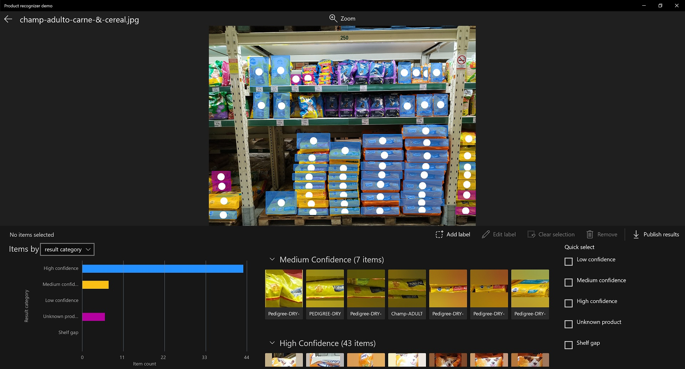

# Object Counting Explorer
This sample illustrates how Custom Vision can identify the items of each brand on shelf.

  

## Prerequisites

* PC with Windows 10 version 17763 or higher
* [Visual Studio 2017](https://visualstudio.microsoft.com/) or higher
* Azure Subscription (you will need a Custom Vision Service resource)

## Source Code Structure
| File | Description |
|-------------|-------------|
| [Views\ObjectCountingExplorerPage](Views/ObjectCountingExplorerPage.xaml.cs) | XAML UI for the demo UI. It displays the image control along with detected items.|
| [Views\InputView](Views/InputView.xaml.cs) | A control used for providing detection project and input image.|
| [Views\ProductEditorControl](Views/ProductEditorControl.xaml.cs) | A control used for adding new or editing existing products in the image.|
| [Controls\AnalyticsChartControl](Controls/AnalyticsChartControl.xaml.cs) | A control used for displaying the chart based on API results.|
| [Controls\CameraControl](Controls/CameraControl.xaml.cs) | The code that contains the camera feed and enables camera captures.|
| [Controls\ImagePickerControl](Controls/ImagePickerControl.xaml.cs) | A control used for providing input images. It allows you to provide images from local images, the web camera or suggested images.|
| [Controls\LeftRightScrollViewer](Controls/LeftRightScrollViewer.xaml.cs) | A control used for providing scrolls to the ImagePickerControl.|
| [Controls\ImageWithRegionEditorsControls](Controls/ImageWithRegionEditorsControls.xaml.cs) | A control used for managing model input images. It allows to display all detected objects in the image.|
| [Controls\ObjectRegionControl](Controls/ObjectRegionControl.xaml.cs) | A control used for drawing regions in the image.|
| [Controls\RegionEditorControl](Controls/RegionEditorControl.xaml.cs) | A control used for drawing editable regions in the image.|
| [Controls\ProductCollectionControl](Controls/ProductCollectionControl.xaml.cs) | The code that contains custom expander control with collection of product items.|
| [Helpers\CustomVisionServiceHelper.cs](Helpers/CustomVisionServiceHelper.cs) | Azure service helper for the Custom Vision API.|
| [Helpers\SettingsHelper.cs](Helpers/SettingsHelper.cs) | Stores some settings in the application local storage.|
| [Models\DataModel.cs](Models/DataModel.cs) | The code that contains all data models.|
| [Models\ImageAnalyzer.cs](Models/ImageAnalyzer.cs) | Helps run the Custom Vision API upon an image.|

## Setup

1. Clone or download this repository
2. Open the solution ObjectCountingExplorer.sln in Visual Studio
3. Run the solution.

## Running the solution

If you are running the sample in your own development PC, just select x64 or x86 for the target platform, Local Machine for the target device and hit F5 in Visual Studio. The app should start and show the input view where you can select detection project and input image to analyze.
